```
██╗   ██╗██╗   ██╗██╗     ███╗   ██╗███████╗██╗ ██████╗ ██╗  ██╗████████╗
██║   ██║██║   ██║██║     ████╗  ██║██╔════╝██║██╔════╝ ██║  ██║╚══██╔══╝
██║   ██║██║   ██║██║     ██╔██╗ ██║███████╗██║██║  ███╗███████║   ██║
╚██╗ ██╔╝██║   ██║██║     ██║╚██╗██║╚════██║██║██║   ██║██╔══██║   ██║
 ╚████╔╝ ╚██████╔╝███████╗██║ ╚████║███████║██║╚██████╔╝██║  ██║   ██║
  ╚═══╝   ╚═════╝ ╚══════╝╚═╝  ╚═══╝╚══════╝╚═╝ ╚═════╝ ╚═╝  ╚═╝   ╚═╝
```

<div align="center">

# VulnSight — A Web Vulnerability Scanner

**Detect. Analyze. Defend.**

A full-stack, real-time security intelligence platform for discovering XSS vulnerabilities,
auditing source code for critical anti-patterns, and tracking live CVE threat feeds —
all inside a sleek, dark-mode-ready dashboard.

---

</div>

---

## Overview

VulnSight is a professional-grade web security platform built with Python and Streamlit. It combines an automated XSS scanning engine, a static source-code analyzer, a real-time CVE intelligence feed, and a full analytics dashboard into a single deployable application.

Designed for security researchers, developers, and penetration testers, VulnSight makes vulnerability discovery fast, visual, and actionable — without requiring any external tooling or complex configuration. It can be spun up locally or deployed as a containerized service in minutes.

---

## Objectives

- Automate the detection of Reflected XSS vulnerabilities across web application forms
- Identify critical security anti-patterns in source code through static regex-based analysis
- Surface the latest CVE disclosures ranked by CVSS severity score
- Provide session-level analytics with severity breakdowns and finding summaries
- Generate exportable HTML vulnerability reports for documentation and client delivery
- Package the entire platform as a containerized, one-command deployment via Docker

---

## Tools & Technologies

<div align="center">


</div>

---

## Project Structure

```
VulnSight/
│── app.py                  # Main Streamlit application & routing
│── scanner.py              # XSS scanning engine (form crawler + payload injection)
│── analyzer.py             # Static source-code security analyzer
│── dashboard.py            # Analytics dashboard renderer
│── reporter.py             # HTML report generator (Jinja2)
│── cve_feed.py             # CVE threat intelligence feed
│── auth.py                 # Session-based authentication module
│── payloads.txt            # XSS payload wordlist
│── requirements.txt        # Python dependencies
│── Dockerfile              # Container build definition
│── docker-compose.yml      # Service orchestration
│── Screenshots/
│   │── vulnsight-login.png
│   │── vuln-scanner.png
│   │── scanning-target.png
│   │── scanner-results.png
│   │── scanner-report.png
│   │── code-analyzer.png
│   │── analyzer-results.png
│   │── analyzer-result-details.png
│   │── analytics-dashboard.png
│   │── threat-intel.png
│   └── threat-intel-detail.png
```

---

## Methodology & Implementation

### 1. Authentication Layer

Session-based login with SHA-256 hashed credentials managed through Streamlit session state. Supports multi-user accounts, logout, and automatic state cleanup on session end.

### 2. XSS Scanning Engine

The scanner crawls a target URL, parses all HTML forms using BeautifulSoup, and systematically injects a wordlist of XSS payloads into every fillable input field. Reflection is verified against both raw and HTML-encoded payload variants to minimize false negatives. SSL errors are handled gracefully with a fallback re-scan.

### 3. Static Code Analyzer

A regex-based rule engine scans pasted source code line-by-line against 12 security rules covering: hardcoded credentials, SQL injection via string concatenation, `eval()` / `exec()` usage, `subprocess shell=True`, insecure deserialization (`pickle`, `yaml.load`), disabled SSL verification, `innerHTML` assignment, `document.write`, debug mode, MD5/SHA-1 usage, and open redirects. Each finding includes the line number, code snippet, and remediation guidance.

### 4. Analytics Dashboard

Session findings are aggregated into metric cards, a severity breakdown bar chart, a finding-type distribution panel, and a paginated results table — all rendered with custom HTML/CSS components inside Streamlit.

### 5. CVE Threat Intelligence Feed

Pulls structured CVE data (ID, description, severity, CVSS score) sorted by criticality. Architecture supports live NVD 2.0 API integration with a mock feed for offline use.

### 6. Report Generation

A Jinja2-powered HTML report renderer produces a fully self-contained, styled vulnerability report with severity summary boxes, a findings table, and XSS-safe output escaping — downloadable directly from the dashboard.

---

## Results & Screenshots

---

### Login — Secure Session Authentication

| 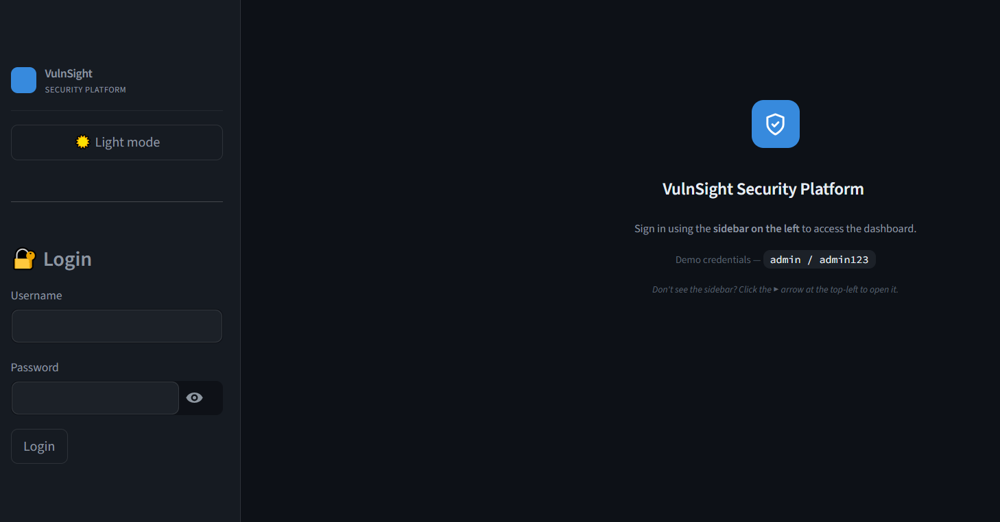 |
|:--:|
| *SHA-256 hashed credential store with a clean sidebar login form. Sessions persist across tab navigation and clear automatically on logout.* |

---

### Scanner — Target Configuration

| 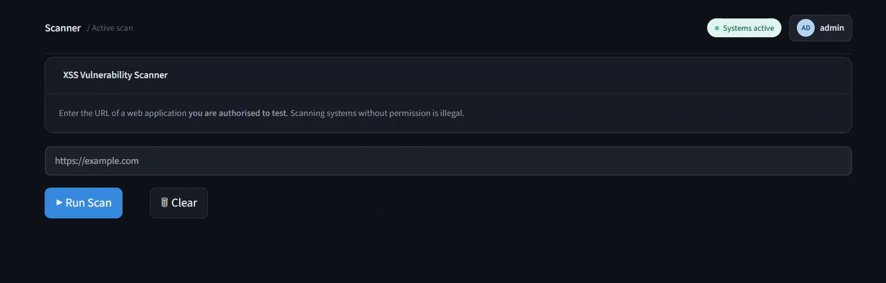 |
|:--:|
| *The scanner module accepts any HTTP/HTTPS target URL. Built-in warnings enforce ethical use — only authorised targets should be tested.* |

---

### Scanner — Active Scan in Progress

| 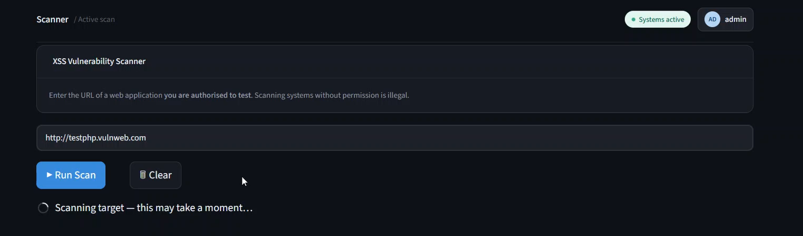 |
|:--:|
| *The engine crawls forms, injects payloads, and streams results in real time. Each request includes a 10-second timeout and SSL error recovery.* |

---

### Scanner — Vulnerability Findings

| 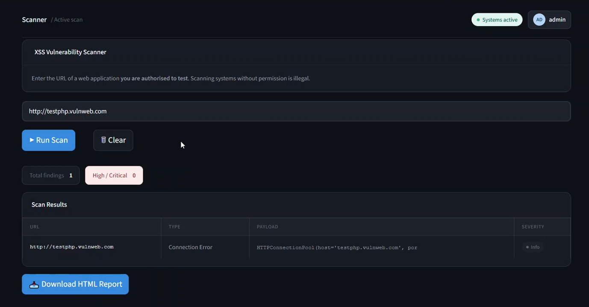 |
|:--:|
| *Confirmed Reflected XSS findings displayed with the triggering payload, affected URL, and severity badge. One confirmed hit per form prevents result spam.* |

---

### Scanner — Exported HTML Report

| 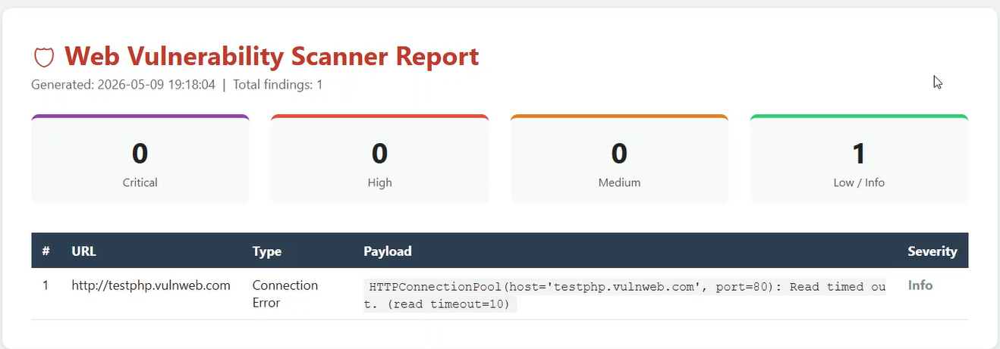 |
|:--:|
| *A fully styled, self-contained HTML report with severity summary cards and a complete findings table — ready for client delivery or internal documentation.* |

---

### Code Analyzer — Source Input

| 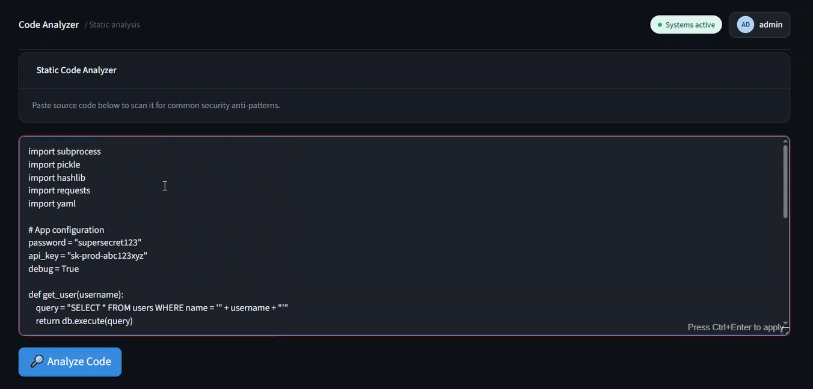 |
|:--:|
| *Paste any source code — Python, JavaScript, or any text-based language — and the engine scans it against 12 security rules instantly.* |

---

### Code Analyzer — All Findings

| 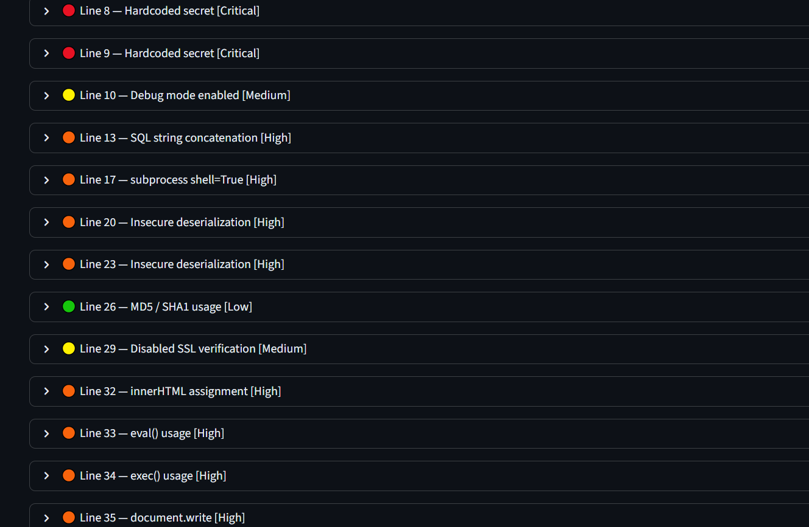 |
|:--:|
| *All detected issues listed with severity badges, line numbers, and issue category. A single vulnerable file can surface Critical, High, Medium, and Low findings simultaneously.* |

---

### Code Analyzer — Finding Detail

| 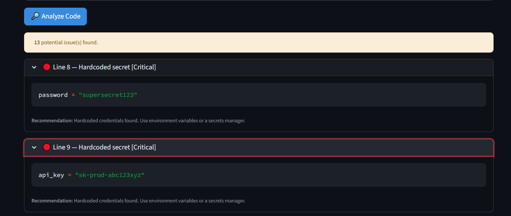 |
|:--:|
| *Each finding expands to show the exact code snippet and a targeted remediation recommendation — no ambiguity, no guesswork.* |

---

### Analytics — Session Dashboard

| 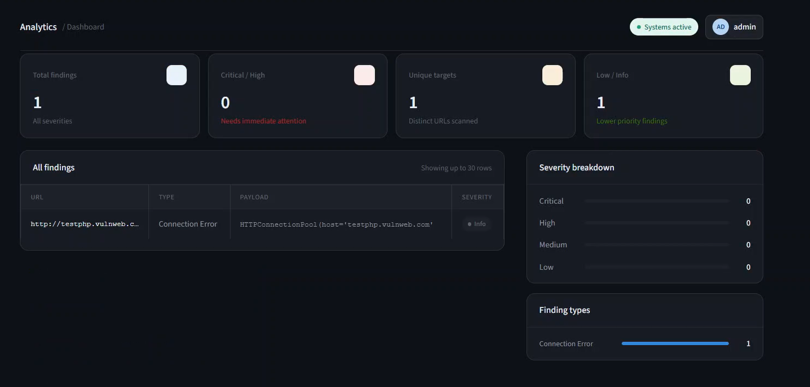 |
|:--:|
| *Four metric cards, a severity distribution panel, a finding-type breakdown, and a paginated results table — giving a complete picture of everything found in the session.* |

---

### Threat Intelligence — CVE Feed

| 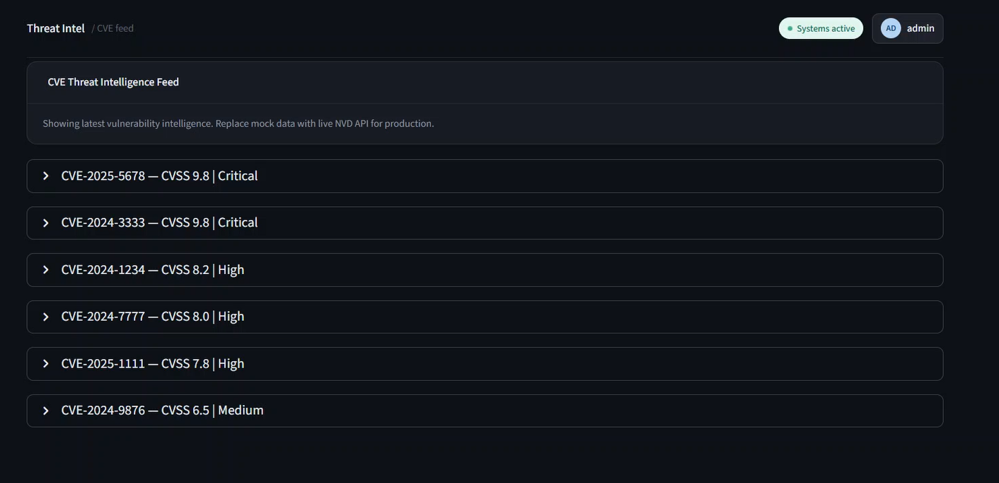 |
|:--:|
| *Live CVE entries sorted by CVSS score. Critical and High severity disclosures surface first for immediate triage.* |

---

### Threat Intelligence — CVE Detail

| 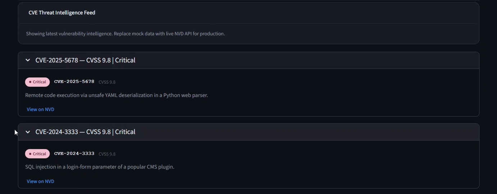 |
|:--:|
| *Each CVE entry expands with a plain-English description, CVSS base score, severity classification, and a direct link to the National Vulnerability Database.* |

---

## Commands & Deployment

**Install dependencies and run locally:**

```bash
pip install -r requirements.txt
streamlit run app.py
```

**Build and run with Docker:**

```bash
docker build -t vulnsight .
docker run -p 8501:8501 vulnsight
```

**Deploy with Docker Compose:**

```bash
docker-compose up --build
```

**Access the platform:**

```
http://localhost:8501
```

**Default credentials:**

```
Username: admin
Password: admin123
```

---

## Conclusion

VulnSight demonstrates that professional-grade security tooling does not require heavyweight frameworks or complex infrastructure. By combining an automated XSS scanner, a static code analyzer, real-time CVE intelligence, and a polished analytics dashboard into a single containerized Python application, the platform delivers genuine security value with minimal setup friction.

The project reinforced core concepts in web security (XSS, SQL injection, insecure deserialization, CSRF), secure coding practices, and the architecture of real-world vulnerability scanning workflows. The modular codebase is designed for extension — swapping the mock CVE feed for a live NVD API, adding CSRF or SQLi scanning modules, or integrating authentication via OAuth are all natural next steps.

VulnSight proves that clarity, design, and security can coexist in a single tool.

---

<div align="center">

Developed as part of my Cybersecurity Internship at SyntecxHub.

</div>
